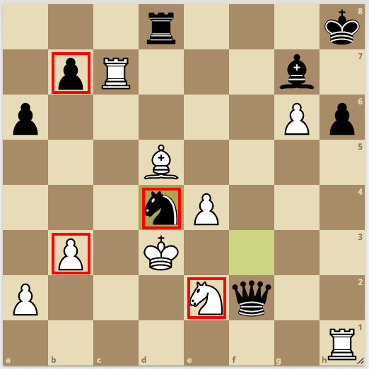

# Problem Tanımı

## Satranç Problemi

Satranç tahtası üzerinde bulunan taşlara göre iki tarafın (siyah – beyaz) mevcut durumlarının puan hesaplaması.

### Açıklama
Mevcut puanı hesaplama algoritması şöyledir:
1. Bir taşın tehdit altında olup olmadığının kontrolü, o taşı tehdit eden karşı renkte bir veya birden fazla taş olması durumunda oluşur.
2. Aşağıdaki tabloda taşların puanları verilmiştir. Eğer bir taş tehdit edilmiyorsa tablodaki puanı alır.
3. Eğer bir taş karşı tarafın taşlarından herhangi biri tarafından tehdit ediliyorsa, tehdit edilen taşın puanı aşağıdaki tablo da verilen puanının yarısı alınır.
4. At ve Fil taşlarının tehdit durumları kontrol edilir. Siyah ve beyaz taşlar için iki ayrı puan hesaplanır.

**Satranç Taşları ve Puanları**  
| Taş İsmi | Kısaltma | Puan |
| --------- | -------- | --- |
| Piyon | p | 1 |
| At | a | 3 |
| Fil | f | 3 |
| Kale | k | 5 |
| Vezir | v | 9 |
| Şah | s | 100 |

## Örnek

Figür 1 Tehdit Durumu

Siyah:(1x0,5)+(7x1)+(1x3)+(1x3)+(2x5)+9+100 = 132,5

Beyaz:(2x0,5)+(5x1)+(1x1,5)+(2x5)+9+100 = 126,5

Program girdileri

Figür 1 tahtasının formatı:

ks xx xx vs xx xx xx ks  
xx xx ps fs xx xx xx xx  
ps xx ss xx ps xx xx ps  
xx ps pb ps xx xx ps xx  
pb xx xx pb ps xx xx xx  
xx xx xx xx as xx pb xx  
xx xx pb xx xx xx pb pb  
kb vb xx xx sb fb xx kb  

Burada ilk harf taş bilgisini (Tabloda verilmiştir.) ikinci harf ise renk bilgisini, xx ile ifade edilen yerler ise tahtadaki boş alanları göstermektedir.
